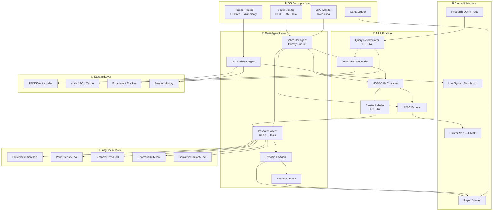
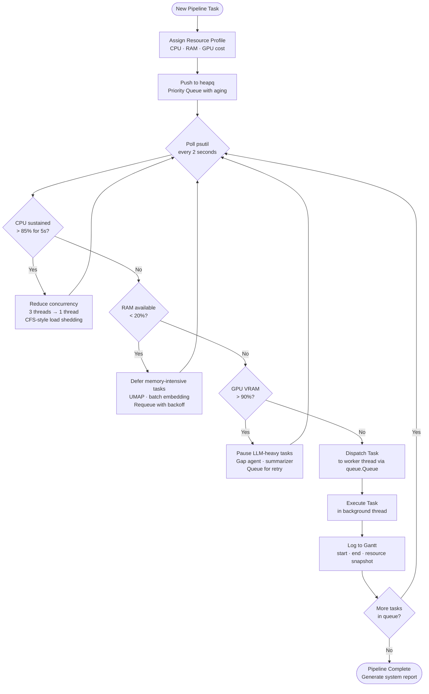

<div align="center">


# ResearchFlow AI

**A Resource-Aware Autonomous Research Intelligence Agent with OS-Integrated Experiment Orchestration**

*An Intelligent Multi-Agent Pipeline for Academic Literature Analysis, Research Gap Identification, and System-Aware Experiment Scheduling*

[](https://python.org)
[](https://streamlit.io)
[](https://langchain.com)
[](https://openai.com)
[](https://pytorch.org)
[](https://faiss.ai)
[](LICENSE)
[](https://github.com)
[](https://docs.astral.sh/ruff/)
[](https://mypy-lang.org/)

---

[**Live Demo**](#demo) · [**Architecture**](#architecture) · [**Installation**](#installation) · [**Features**](#features) · [**OS Concepts**](#os-concepts-integration) · [**Docs**](docs/)

</div>

---

## Overview

Modern academic research operates at a scale that fundamentally exceeds human cognitive bandwidth. As of 2024, arXiv publishes over **15,000 new papers per month** across CS, Physics, and Engineering. A researcher surveying a field like *Federated Learning for Edge Devices* spends **2–4 weeks** on manual literature review before any original work begins.

**ResearchFlow AI eliminates that bottleneck.**

It autonomously retrieves, embeds, clusters, and analyzes academic papers via a LangChain ReAct agent — identifying underexplored research gaps in under 30 minutes. Simultaneously, a production-grade OS scheduling layer dynamically throttles the NLP pipeline based on live CPU, RAM, and GPU telemetry, demonstrating that real AI systems must be **resource-aware, not resource-oblivious**.

> **This is not a chatbot.** It is a multi-agent research operating environment that bridges literature analysis, hypothesis generation, and OS-integrated experiment orchestration into a single coherent system.

---

## Features

### 🔬 Research Intelligence Agent
- **Autonomous arXiv retrieval** — LangChain query reformulation expands natural language topics into structured API syntax with synonyms and sub-queries
- **SPECTER embeddings** — domain-optimized scientific text representations (outperforms general-purpose models on academic text)
- **HDBSCAN clustering** — density-based, no fixed cluster count, handles outlier papers naturally
- **Interactive UMAP visualization** — 2D scatter plot of the research landscape via Plotly, hoverable paper metadata
- **ReAct gap detection** — agent reasons over cluster evidence using 5 custom tools, produces structured gap reports with confidence scores
- **Reproducibility scoring** — heuristic keyword proxy (0–1) per cluster flagging open-code / open-dataset papers
- **Thesis hypothesis generation** — 3–5 scoped research questions ranked by novelty score with methodology type suggestions
- **Reading roadmap** — papers ordered into foundational → methodological → recent tiers for structured onboarding

### ⚙️ OS-Integrated Lab Assistant
- **Priority Queue Scheduler** — `heapq`-backed dispatcher with priority aging to prevent task starvation
- **Feedback-controlled scheduling** — psutil polled every 2s; CPU/RAM/GPU thresholds dynamically adjust concurrency and task priorities
- **Process monitoring** — own PID tree tracked, 2σ anomaly detection flags resource outliers
- **GPU memory monitoring** — `torch.cuda.memory_stats()` integrated into scheduling decisions
- **Gantt chart execution timeline** — every task start/end/deferral recorded and rendered in Streamlit
- **Bottleneck detection** — heuristic rules classify CPU-bound, I/O-bound, and OOM-risk conditions
- **Structured experiment reports** — JSON-logged runs with system resource snapshots per task

### 🏗️ Engineering Quality
- Fully modular: each pipeline stage independently replaceable
- All configuration externalized to `configs/*.yaml` — zero hardcoded values
- `pyproject.toml` with ruff + mypy enforced via pre-commit hooks
- GitHub Actions CI: lint → type-check → pytest on every push
- Docker Compose for reproducible dev environment
- MkDocs documentation site with API reference

---

## Architecture



---

## OS Concepts Integration

ResearchFlow AI implements genuine Operating Systems concepts at the application layer — not cosmetic wrappers around library calls.



| OS Concept | Implementation in ResearchFlow AI |
|---|---|
| **Process Scheduling** | `heapq` priority queue with dynamic priority adjustment based on live CPU load — analogous to Linux CFS nice-value adjustment |
| **Memory Management** | Pre-dispatch RAM check via `psutil.virtual_memory().available`; memory-intensive tasks deferred when headroom < 20% |
| **CPU Scheduling** | Sustained CPU > 85% triggers concurrency reduction from 3 → 1 thread, simulating load-sensitive policy adjustment |
| **Background Process Handling** | Embedding and API tasks run as background threads via `threading`; UI remains responsive via `queue.Queue` producer-consumer pattern |
| **Process Monitoring** | Own PID + child PIDs tracked via `psutil.process_iter()`; 2σ anomaly detection flags resource outliers |
| **GPU Resource Management** | `torch.cuda.memory_stats()` integrated into scheduling decisions; LLM tasks paused when VRAM > 90% |
| **Execution Timeline** | Gantt-chart logging of task burst times, preemptions, and deferrals — the standard OS scheduling analysis representation |

---

## Repository Structure

```
researchflow-ai/
│
├── agents/                          # autonomous agent definitions
│   ├── research_agent.py            # arXiv retrieval + ReAct gap-detection agent
│   ├── lab_agent.py                 # system monitor + experiment orchestrator
│   ├── scheduler_agent.py           # OS-aware priority queue task dispatcher
│   ├── hypothesis_agent.py          # thesis hypothesis + novelty scoring
│   └── roadmap_agent.py             # reading roadmap builder
│
├── pipelines/                       # end-to-end pipeline orchestration
│   ├── research_pipeline.py         # ingest → embed → cluster → gap → report
│   ├── lab_pipeline.py              # monitor → schedule → log → alert
│   └── pipeline_base.py             # abstract base, retry logic, event hooks
│
├── scheduler/                       # OS-concept task scheduling layer
│   ├── priority_queue.py            # heapq-backed priority queue with aging
│   ├── resource_policy.py           # threshold policies (CPU/RAM/GPU rules)
│   ├── task_registry.py             # task definitions, resource profiles, DAG
│   ├── gantt_logger.py              # execution timeline recorder → Gantt chart
│   └── preemption_handler.py        # deferral, retry, and backoff logic
│
├── monitoring/                      # system telemetry & process management
│   ├── system_monitor.py            # psutil CPU/RAM/disk poller (background thread)
│   ├── gpu_monitor.py               # torch.cuda VRAM tracker
│   ├── process_tracker.py           # own PID tree, anomaly detection (2σ)
│   ├── bottleneck_detector.py       # heuristic rules: I/O bound, CPU bound, OOM risk
│   └── alert_manager.py             # threshold alerts → Streamlit toast / log
│
├── nlp/                             # NLP processing modules
│   ├── embedder.py                  # SPECTER / MiniLM sentence transformer wrapper
│   ├── clusterer.py                 # HDBSCAN clustering + silhouette scoring
│   ├── reducer.py                   # UMAP 2D projection for visualization
│   ├── summarizer.py                # LangChain summarization chain per cluster
│   └── query_reformulator.py        # GPT-4o arXiv query expansion
│
├── vector_store/                    # vector database & semantic search
│   ├── faiss_store.py               # FAISS index build, save, load, search
│   ├── paper_indexer.py             # maps paper ID → FAISS vector
│   └── semantic_search.py           # k-NN query interface for gap detection tools
│
├── retrieval/                       # external data retrieval layer
│   ├── arxiv_client.py              # arXiv API wrapper with pagination + dedup
│   ├── paper_parser.py              # metadata extraction → Paper dataclass
│   └── cache_manager.py             # local JSON cache with TTL & eviction
│
├── tools/                           # LangChain custom tool definitions
│   ├── cluster_summary_tool.py      # fetches thematic cluster summaries
│   ├── paper_density_tool.py        # paper count per cluster
│   ├── temporal_trend_tool.py       # publication year distribution analysis
│   ├── reproducibility_tool.py      # keyword proxy for open-code / datasets
│   └── semantic_similarity_tool.py  # FAISS-backed related paper lookup
│
├── reports/                         # report generation & export
│   ├── report_generator.py          # LangChain doc chain → structured Markdown
│   ├── pdf_exporter.py              # fpdf2 Markdown → PDF conversion
│   └── templates/
│       ├── research_report.md.j2    # Jinja2 research report template
│       └── lab_report.md.j2         # Jinja2 experiment/system report template
│
├── experiment_tracker/              # lightweight experiment management
│   ├── run_tracker.py               # session ID, params, metrics, status
│   ├── metric_logger.py             # time-series metric recording
│   └── run_comparator.py            # multi-run diff viewer
│
├── app/                             # Streamlit UI
│   ├── main.py                      # Streamlit entry point
│   ├── pages/
│   │   ├── 01_research_agent.py     # research query → cluster map → gaps
│   │   ├── 02_lab_assistant.py      # live system dashboard + Gantt chart
│   │   ├── 03_hypothesis_studio.py  # thesis ideation workspace
│   │   └── 04_session_history.py    # past research sessions browser
│   └── components/
│       ├── cluster_plot.py          # interactive Plotly UMAP scatter
│       ├── gantt_chart.py           # task execution timeline renderer
│       ├── resource_dashboard.py    # live CPU/RAM/GPU gauges
│       └── paper_card.py            # paper metadata display card
│
├── configs/                         # all configuration, zero hardcoded values
│   ├── agent_config.yaml            # agent params, model names, temperature
│   ├── scheduler_config.yaml        # CPU/RAM/GPU thresholds, concurrency limits
│   ├── pipeline_config.yaml         # pipeline stages, retry policy
│   └── logging_config.yaml          # structured logging, levels, handlers
│
├── cache/                           # runtime cache (gitignored)
│   ├── papers/                      # cached arXiv JSON responses
│   └── embeddings/                  # cached .npy embedding arrays
│
├── artifacts/                       # model outputs & build artifacts
│   ├── faiss_indexes/               # persisted FAISS index files
│   └── cluster_models/              # serialized HDBSCAN model states
│
├── logs/                            # structured JSON logs (gitignored)
│   ├── system_monitor.log
│   ├── pipeline_runs.log
│   └── agent_traces.log
│
├── data/                            # sample datasets & test fixtures
│   ├── sample_papers.json           # 50-paper sample for offline testing
│   └── benchmark_queries.json       # standardised eval query set
│
├── notebooks/                       # exploratory analysis (Jupyter)
│   ├── 01_arxiv_eda.ipynb           # data exploration
│   ├── 02_embedding_analysis.ipynb  # embedding quality, cluster stability
│   ├── 03_scheduler_sim.ipynb       # scheduling policy simulation
│   └── 04_gap_eval.ipynb            # gap detection quality assessment
│
├── tests/                           # pytest test suite
│   ├── unit/                        # unit tests per module
│   ├── integration/                 # end-to-end pipeline tests
│   └── fixtures/                    # mock API responses
│
├── docs/                            # documentation site (MkDocs)
│   ├── architecture.md
│   ├── os_concepts.md
│   ├── agent_design.md
│   └── api_reference.md
│
├── .github/
│   ├── workflows/ci.yml             # GitHub Actions: lint, test, type-check
│   └── PULL_REQUEST_TEMPLATE.md
│
├── .env.example                     # OPENAI_API_KEY, HF_TOKEN, etc.
├── pyproject.toml                   # poetry / ruff / mypy config
├── requirements.txt
├── Makefile                         # make run | test | lint | docs
├── docker-compose.yml               # containerised dev environment
├── CONTRIBUTING.md
├── CHANGELOG.md
├── LICENSE
└── README.md
```

---

## System Workflow

```
Step 01  →  User inputs research topic via Streamlit UI
Step 02  →  Scheduler reads live CPU/RAM/GPU metrics; tasks enqueued into priority heap
Step 03  →  Query Reformulation Agent (GPT-4o) expands input into structured arXiv syntax
Step 04  →  arXiv API retrieves top 50–100 papers; metadata extracted, deduplicated, cached
Step 05  →  SPECTER Embedder encodes all abstracts; vectors indexed in FAISS
Step 06  →  HDBSCAN clusters embedding space; UMAP projects to 2D interactive scatter plot
Step 07  →  Cluster Labeling Agent (GPT-4o) names each thematic cluster from sample abstracts
Step 08  →  Research Gap Agent (ReAct) iterates: hypothesize → call tool → revise → synthesize
Step 09  →  Hypothesis Agent generates 3–5 scoped thesis directions ranked by novelty score
Step 10  →  Roadmap Agent orders papers into foundational → methodological → recent tiers
Step 11  →  Report Generator compiles all outputs into structured Markdown + PDF document
Step 12  →  Gantt Logger renders task execution timeline; Lab Agent writes system report
Step 13  →  User downloads Research Intelligence Report (.md or .pdf)
```

---

## Where Generative AI Is Used

GenAI is embedded at **five distinct points** in the pipeline — not used as a monolithic chatbot layer.

| Pipeline Stage | Model | Role |
|---|---|---|
| **Query Reformulation** | GPT-4o via LangChain | Transforms casual topic into multi-query arXiv syntax with synonym expansion |
| **Cluster Labeling** | GPT-4o Summarization Chain | Reads 3–5 representative abstracts per cluster; generates human-readable thematic label |
| **Gap Detection** | GPT-4o ReAct Agent | Iterates reasoning loop over cluster tools; synthesizes structured gap report |
| **Hypothesis Generation** | GPT-4o | Produces scoped thesis questions with methodology type and novelty justification |
| **Report Synthesis** | GPT-4o Document Chain | Integrates all module outputs into a coherent, professionally structured report |

---

## Installation

### Prerequisites

- Python 3.11+
- OpenAI API key
- *(Optional)* CUDA-capable GPU for GPU monitoring features

### Quick Start

```bash
# 1. Clone the repository
git clone https://github.com/<your-username>/researchflow-ai.git
cd researchflow-ai

# 2. Create and activate virtual environment
python -m venv .venv
source .venv/bin/activate        # Linux / macOS
# .venv\Scripts\activate         # Windows

# 3. Install dependencies
pip install -r requirements.txt

# 4. Configure environment variables
cp .env.example .env
# Open .env and add your OPENAI_API_KEY

# 5. Launch the application
streamlit run app/main.py

# OR use the Makefile
make run
```

### Docker (Recommended for reproducibility)

```bash
docker-compose up --build
# App available at http://localhost:8501
```

### Environment Variables

```bash
# .env.example
OPENAI_API_KEY=sk-...           # Required
HF_TOKEN=hf_...                 # Optional: for gated HuggingFace models
ARXIV_MAX_RESULTS=100           # Papers retrieved per query (default: 100)
CACHE_TTL_HOURS=24              # Cache expiry (default: 24h)
SCHEDULER_CPU_THRESHOLD=85      # CPU % threshold for concurrency reduction
SCHEDULER_RAM_THRESHOLD=20      # Available RAM % threshold for task deferral
SCHEDULER_GPU_THRESHOLD=90      # GPU VRAM % threshold for LLM task pause
LOG_LEVEL=INFO
```

### Makefile Commands

```bash
make run        # Launch Streamlit app
make test       # Run pytest suite
make lint       # Run ruff + mypy
make docs       # Serve MkDocs documentation
make clean      # Remove cache, logs, artifacts
```

---

## Technology Stack

| Component | Technology | Version | Purpose |
|---|---|---|---|
| Frontend | Streamlit | 1.35 | Multi-page interactive web UI |
| LLM Orchestration | LangChain | 0.2 | Agent framework, chains, tool use |
| Language Model | OpenAI GPT-4o | latest | Query reformulation, labeling, gap analysis, synthesis |
| Literature API | arXiv Python API | 2.1 | Paper retrieval and metadata extraction |
| Embeddings | Sentence Transformers (SPECTER) | 2.7 | Dense semantic representations of abstracts |
| Vector Database | FAISS | 1.8 | k-NN semantic search for agent tools |
| Clustering | HDBSCAN | 0.8 | Density-based thematic cluster assignment |
| Dimensionality Reduction | UMAP-learn | 0.5 | 2D projection for cluster visualization |
| Visualization | Plotly | 5.21 | Interactive scatter plots, Gantt chart |
| Deep Learning | PyTorch | 2.3 | Embedding inference + GPU memory tracking |
| OS Monitoring | psutil | 6.0 | CPU, RAM, disk, process monitoring |
| GPU Monitoring | torch.cuda | — | VRAM allocation and reservation tracking |
| Task Scheduling | Python heapq + queue + threading | stdlib | Priority queue scheduler, background task management |
| Report Export | fpdf2 + Jinja2 | — | PDF and Markdown report generation |
| Code Quality | ruff + mypy | — | Linting, formatting, type checking |
| Testing | pytest | 8.2 | Unit + integration test suite |
| CI/CD | GitHub Actions | — | Automated lint, test, type-check on push |
| Docs | MkDocs + Material | — | Documentation site with API reference |
| Containerisation | Docker Compose | — | Reproducible development environment |

---

## Outputs Per Research Session

| Output | Description |
|---|---|
| **Interactive Cluster Map** | UMAP 2D scatter plot, colour-coded by theme, hoverable paper metadata |
| **Thematic Cluster Report** | Labeled clusters with representative papers, publication density, temporal trend |
| **Research Gap Analysis** | 3–5 underexplored directions with evidence: paper count, recency, reproducibility score |
| **Thesis Hypotheses** | 3–5 scoped research questions ranked by novelty, each with suggested methodology type |
| **Reading Roadmap** | 10–20 papers in foundational → methodological → recent-results tiers |
| **System Execution Report** | Full task timeline, resource utilization per task, scheduler decisions, bottleneck flags |

---

## Screenshots

> *Full demo screenshots to be added after Milestone 1 submission.*

| View | Description |
|---|---|
| `screenshot_cluster_map.png` | Interactive UMAP scatter — colour-coded research landscape |
| `screenshot_system_dashboard.png` | Live CPU/RAM/GPU gauges + alert feed |
| `screenshot_gantt_chart.png` | Task execution timeline with deferral events highlighted |
| `screenshot_hypothesis_studio.png` | 3 thesis directions with novelty scores |
| `screenshot_report.png` | Full research intelligence report output |
| `screenshot_agent_trace.png` | ReAct reasoning loop: Thought → Action → Observation |

---

## Demo

```bash
# Run with sample data (no API key required for offline demo)
streamlit run app/main.py -- --demo

# Sample query that works well out of the box:
# "Multimodal Large Language Models for Medical Diagnosis"
# "Federated Learning for Edge Devices"
# "Zero-Shot Generalization in Robotics"
```

---

## Branch Strategy

| Branch | Purpose |
|---|---|
| `main` | Production-ready, protected. Merge via PR with passing CI only. |
| `dev` | Integration branch. All feature branches merge here first. |
| `feat/research-agent` | New agent features and LangChain tool additions |
| `feat/scheduler` | OS scheduling logic and resource policy updates |
| `feat/nlp-pipeline` | Embedding, clustering, UMAP improvements |
| `fix/<issue-number>` | Bug fixes referencing the GitHub issue |
| `docs/<topic>` | Documentation-only changes |
| `chore/<name>` | Dependency updates, CI config, tooling |

---

## Commit Convention

This project follows [Conventional Commits](https://www.conventionalcommits.org/).

```
feat(scheduler): add aging mechanism to prevent starvation in priority queue
feat(research-agent): implement TemporalTrendTool for publication year analysis
fix(embedder): resolve OOM on large abstract batches with chunked inference
refactor(nlp): decouple HDBSCAN clusterer from UMAP reducer into separate modules
docs(architecture): add Mermaid OS scheduling flowchart to README
test(scheduler): add unit tests for CPU-threshold deferral logic
chore(deps): upgrade sentence-transformers to 2.7.0
perf(faiss): switch to IVFFlat index for 10x faster k-NN at scale
```

---

## Future Work

- [ ] **Semantic Scholar citation graph** — real citation data via S2 API replacing keyword-overlap proxy
- [ ] **Multi-source retrieval** — PubMed, IEEE Xplore, and ACL Anthology alongside arXiv
- [ ] **Fine-tuned gap detector** — supervised classifier trained on labeled research-gap examples
- [ ] **Weights & Biases integration** — stream experiment metrics to W&B dashboard
- [ ] **Multi-agent debate** — two Research Agents argue competing hypotheses; a third adjudicates
- [ ] **Full-text PDF RAG** — ingest complete PDFs via LangChain PDF loader + vector retrieval
- [ ] **Kubernetes-native scheduler** — lift scheduling layer into a real k8s operator
- [ ] **Chrome extension** — annotate arXiv papers in-browser and sync to ResearchFlow session
- [ ] **Incremental clustering** — update clusters as new papers arrive without full recompute

---

## Contributing

Contributions are welcome. Please read [CONTRIBUTING.md](CONTRIBUTING.md) before opening a pull request.

1. Fork the repository
2. Create a feature branch: `git checkout -b feat/your-feature`
3. Commit using conventional commits: `git commit -m "feat(scope): description"`
4. Push and open a PR against `dev`
5. Ensure CI passes before requesting review

---

## Acknowledgements

- [arXiv](https://arxiv.org) — open-access paper repository
- [SPECTER](https://github.com/allenai/specter) — Allen AI scientific text embeddings
- [LangChain](https://langchain.com) — agent and chain framework
- [HDBSCAN](https://hdbscan.readthedocs.io) — density-based clustering
- [UMAP](https://umap-learn.readthedocs.io) — dimensionality reduction
- [FAISS](https://faiss.ai) — Facebook AI Similarity Search

---

## License

MIT License — see [LICENSE](LICENSE) for details.

---

<div align="center">

Built with precision for the intersection of AI systems and Operating Systems.

*"Production AI pipelines must be resource-aware, not resource-oblivious."*

</div>
