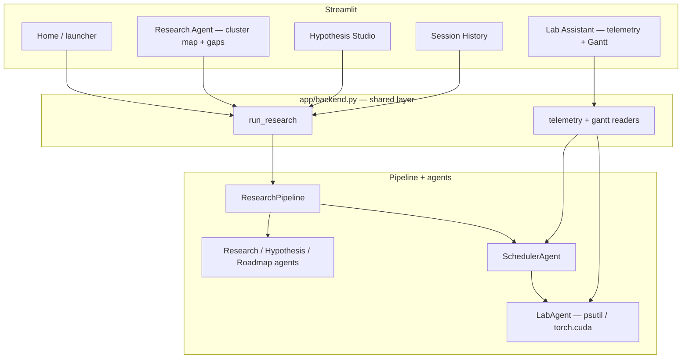

<div align="center">

# ResearchFlow AI

**A resource-aware research-intelligence agent with OS-integrated experiment scheduling.**

Retrieves and clusters academic literature, detects under-explored research gaps, and runs the NLP pipeline under a custom priority-queue scheduler that gates work against live CPU / RAM / GPU telemetry.

[](https://python.org)
[](https://streamlit.io)
[](LICENSE)
[](https://github.com/<your-username>/researchflow-ai/actions/workflows/ci.yml)

</div>

> **Status — honest snapshot.** The Streamlit app runs end-to-end in demo mode with no API key. With an OpenAI key and the backend installed, the full pipeline (query → arXiv → embed → cluster → gap detection → hypotheses → report) runs under the scheduler. Some pieces are still in progress and are called out in [Known limitations](#known-limitations) rather than hidden. This is a working system under active development, not a finished product.

---

## What it does

Surveying a research area means reading a few hundred abstracts to find the clusters, the saturated sub-topics, and the gaps worth a thesis. ResearchFlow AI automates the mechanical part of that:

1. Expands a plain-language topic into structured arXiv queries (GPT-4o).
2. Retrieves and de-duplicates papers, embeds the abstracts (SPECTER).
3. Clusters the embedding space (HDBSCAN) and projects it to 2D (UMAP) for an interactive map.
4. Labels each cluster, then runs a ReAct gap-detection agent over the clusters.
5. Generates scoped thesis hypotheses ranked by novelty and feasibility, plus a reading roadmap and a Markdown/PDF report.

Every stage runs as a task submitted to a custom scheduler, which decides *when* to dispatch each one based on live system load.

---

## The OS-integration angle (what it actually is)

This is the part most worth understanding precisely, because it's easy to overstate.

The scheduler is a **priority-queue task dispatcher with resource-aware admission control**. Concretely, it implements:

| Concept | Implementation |
|---|---|
| Priority scheduling | `heapq` min-heap ordered by priority, FIFO tiebreak within a level |
| Priority aging | starved tasks get a periodic priority boost, preventing indefinite deferral |
| Resource-gated admission | each task carries a CPU/RAM/GPU cost profile; the policy defers dispatch when live telemetry can't absorb it |
| Starvation safety valve | a task deferred too many times is force-dispatched regardless of load |
| Load-shedding | sustained high CPU / OOM-risk drops the worker pool from 3 → 1 |
| Execution logging | every dispatch / deferral / completion is recorded with a resource snapshot and rendered as a Gantt timeline |

**What it is not:** it is not a reimplementation of Linux CFS. CFS is a fair-share, virtual-runtime scheduler; this is priority + admission control + load-shedding. The honest comparison is to classical priority scheduling with aging, plus an admission-control gate.

**One real caveat:** the worker pool uses threads, and the CPU-heavy stages (embedding, clustering) run Python under the GIL, so reducing the thread count is mostly about UI responsiveness and dispatch backpressure, not true parallel CPU reduction. Moving CPU-bound stages to a `ProcessPoolExecutor` is on the roadmap; until then the throttle is best described as admission control, not CPU partitioning.

---

## Architecture


```mermaid
graph TB
    subgraph UI["Streamlit"]
        A[Home / launcher]
        B[Research Agent — cluster map + gaps]
        C[Lab Assistant — telemetry + Gantt]
        D[Hypothesis Studio]
        E[Session History]
    end
    subgraph BACKEND["app/backend.py — shared layer"]
        F[run_research]
        G[telemetry + gantt readers]
    end
    subgraph PIPE["Pipeline + agents"]
        H[ResearchPipeline]
        I[Research / Hypothesis / Roadmap agents]
        J[SchedulerAgent]
        K[LabAgent — psutil / torch.cuda]
    end
    A & B & D & E --> F --> H
    C --> G
    H --> I
    H --> J
    J --> K
    G --> J & K
```

---

## Quick start

```bash
git clone https://github.com/<your-username>/researchflow-ai.git
cd researchflow-ai

python -m venv .venv && source .venv/bin/activate   # Windows: .venv\Scripts\activate
pip install -r requirements.txt

# Optional: real pipeline needs an OpenAI key (demo mode works without it)
cp .env.example .env   # then add OPENAI_API_KEY

streamlit run app/main.py     # run from the repo root
```

The app opens in **demo mode** if no backend / key is present — every page renders with sample data so you can see the full UI immediately. Toggle demo off to run the real pipeline.

---

## Tech stack

| Area | Tools |
|---|---|
| UI | Streamlit, Plotly |
| LLM orchestration | LangChain, OpenAI GPT-4o |
| NLP | Sentence-Transformers (SPECTER), HDBSCAN, UMAP |
| Retrieval | arXiv API |
| Systems | psutil, torch.cuda, `heapq` / `threading` / `concurrent.futures` |
| Tooling | ruff, pytest, GitHub Actions |

---

## Project layout

```
app/            Streamlit UI — backend.py (shared layer) + main.py + pages/
agents/         research, lab, scheduler, hypothesis, roadmap agents
pipelines/      ResearchPipeline orchestration + base
nlp/            embedder, clusterer, reducer, summarizer, query reformulator
retrieval/      arXiv client, parser, cache
vector_store/   FAISS index + semantic search
reports/        generated run reports (persisted)
configs/        thresholds + pipeline config (YAML)
tests/          pytest suite
```

---

## Known limitations

Kept deliberately visible — these are accurate as of now.

- **UMAP coordinates aren't yet surfaced to the UI.** The pipeline computes them but doesn't store them on the result, so the cluster map falls back to a synthetic per-cluster layout (flagged in-app). One-line fix pending.
- **`experiment_tracker/` is not implemented yet.** Session history persists via the generated report files in `reports/`, not a tracker DB.
- **CPU-bound stages run under the GIL** (see the scheduler caveat above).
- **Test coverage is minimal.** CI currently gates on lint + compile, not behavioural tests.
- **Per-run LLM cost/latency is non-trivial.** GPT-4o is used at five pipeline stages; a full run costs real money and minutes. Demo mode avoids both.

---

## License

MIT — see [LICENSE](LICENSE).
